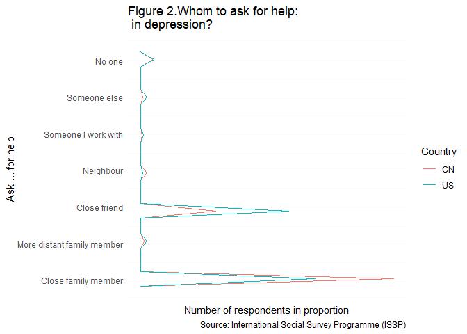

Social Networks and Social Resources
================
Kejing Li
11/11/2019

  - [Introduction](#introduction)
  - [Data](#data)
      - [ISSP](#issp)
      - [Social Networks](#social-networks)
      - [Selection Method](#selection-method)
      - [Mode of Data Collection](#mode-of-data-collection)
      - [Variables Selected for the analysis
        purpose](#variables-selected-for-the-analysis-purpose)
  - [Social Network](#social-network)
      - [Whom to ask for help](#whom-to-ask-for-help)
          - [In household when ill](#in-household-when-ill)
          - [In depression](#in-depression)
          - [In giving advice about family
            problems](#in-giving-advice-about-family-problems)
          - [In enjoying a pleasant social occasion
            with](#in-enjoying-a-pleasant-social-occasion-with)
      - [Home population](#home-population)
          - [China](#china)
          - [USA](#usa)
  - [Social resources](#social-resources)
  - [Conclusions](#conclusions)
  - [Citation](#citation)

# Introduction

A social network is a social structure made up of a set of social actors
(such as individuals or organizations), sets of dyadic ties, and other
social interactions between actors. Countless research shows that
individual’s mental and physical wellbeing is largely dependent on a
quality social networks back up with necessary social resources. This
report aims at exploring the contributing factors and patterns of
satisfactory level towards life by analyzing selected aspects of social
networks and social networks in USA and China.

# Data

The database **International Social Survey Programme: Social Networks
and Social Resources - ISSP 2017** is the source data for the report.
This dataset is collected during 13.01.2017 and 07.03.2019

## ISSP

The International Social Survey Programme (ISSP) is a continuing annual
program of cross-national survey collaboration, covering a wide range of
topics important for social science research. Since 1985 the ISSP
provides international data sets, enabling cross-cultural and
cross-temporal research.

## Social Networks

‘Social Networks’ is one of the eleven ISSP topic modules. ISSP Social
Networks modules essentially deal with issues, such as nature and
contacts with family members and friends, participation in associations
and groups, duties and rights in social networks and social trust.

## Selection Method

  - Probability Sample
  - Probability Sample: Simple random
  - Probability Sample: Systematic random
  - Probability Sample: Stratified
  - Probability Sample: Multistage

## Mode of Data Collection

  - Face-to-face interview
  - Self-administered questionnaire
  - Telephone interview

## Variables Selected for the analysis purpose

1.  v22 Q7b Whom to ask for help: in household when ill?
2.  v23 Q7c Whom to ask for help: in depression?
3.  v24 Q7d Whom to ask for help: in giving advice about family
    problems?
4.  v25 Q7e Whom to ask for help: in enjoying a pleasant social occasion
    with?
5.  v58 Q30 Life in general: How satisfied on the whole?
6.  HOMPOP How many persons in household
7.  URBRURAL Place of living: urban – rural

# Social Network

## Whom to ask for help

To analyze the social network, four help-seeking scenarios are
investigated. As people would more likely to turn to those they trust or
feel comfortable with, these questions give implications on their
perceived social relationships.

### In household when ill

As shown in Figure 1, both Americans and the Chinese are more likely to
ask help from close family members when they are ill, while a
discernible variation happens on the friend scale. Americans tend to
seek help friends as well.

<!-- -->

### In depression

<!-- -->

### In giving advice about family problems

With a Similar pattern occurring in the situation of depression (Figure
2) and meeting family problems (Figure 3), close friends accounted for a
higher proportion than the first scenario.

<!-- -->

### In enjoying a pleasant social occasion with

In figure 4, it can be learned that in terms of recreation, Americans
will consider family members and friends almost equally, and there is
smaller difference between these two groups among Chinese as well.
People get more diverse options in positive scenarios than negative
ones.

<!-- -->

## Home population

From the above analysis, it is quite evident that close family members
are the core of the social networks whatever the country is, though the
Chinese more rely on families than Americans.

Since the family is an indispensable element of social networks, a
question arises on the active individuals that exerting the
influence(Table 1). Here, the satisfactory level is included to see
whether the number of family members positively related to the life
satisfaction level of an individual.

### China

For China, life satisfactory doesn’t seem to have a relationship with
the home population. In figure 5, for any given number of home
population, the majority of people (the lightest block in each column
fall into that chosen home population all feel fairly satisfied,
uninfluenced by the value of the home population.

-1.png)<!-- -->

### USA

For the USA, shown in figure 6 homes of two or four people are in
general more satisfied than the others, with the majority feel very
satisfied.

-1.png)<!-- -->

# Social resources

Regarding social resources, the place of living is employed as an
indicator. In China, fairly Satisfied holds true regardless of the place
of living. However, in the USA, satisfactory levels concentrate around
very satisfied and fairly satisfied with small fluctuation among places.
Further investigation is needed to determine whether the difference
between the two countries is caused by different social resources.

<!-- -->

# Conclusions

  - Chinese are more family-oriented than Americans in terms of social
    networks.
  - Family is the core of social networks.
  - The home population doesn’t have an influence on life satisfactory
    in China, while in the US, homes of 2 and 4 are more satisfied than
    the others.
  - In general, Americans are more satisfied towards their life than
    Chinese.

# Citation

ISSP Research Group (2019): International Social Survey Programme:
Social Networks and Social Resources - ISSP 2017. GESIS Data Archive,
Cologne. ZA6980 Data file Version 2.0.0, <doi:10.4232/1.13322>
